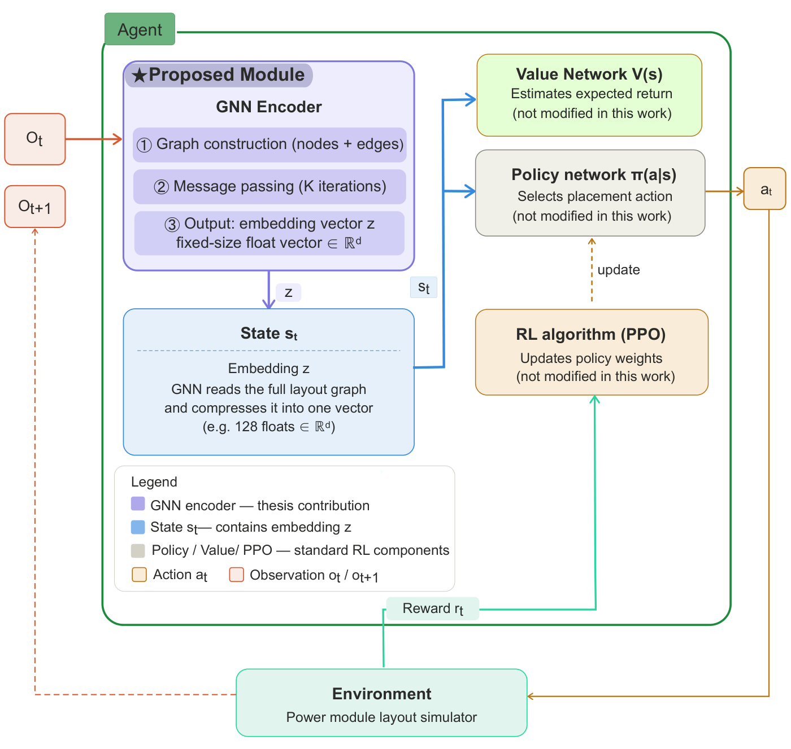
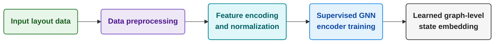
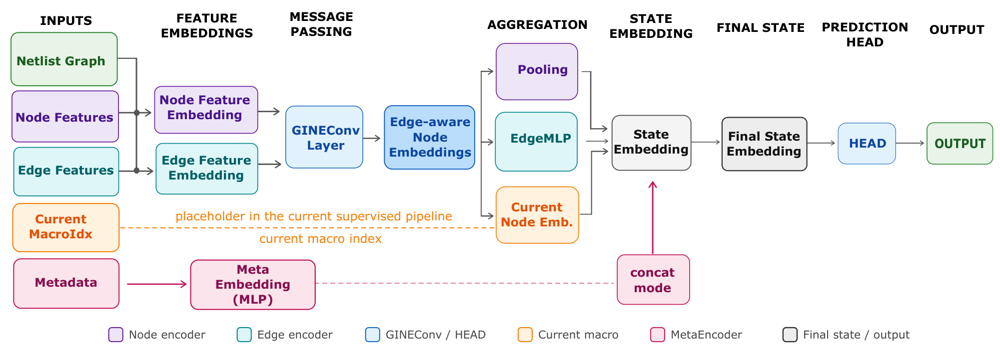
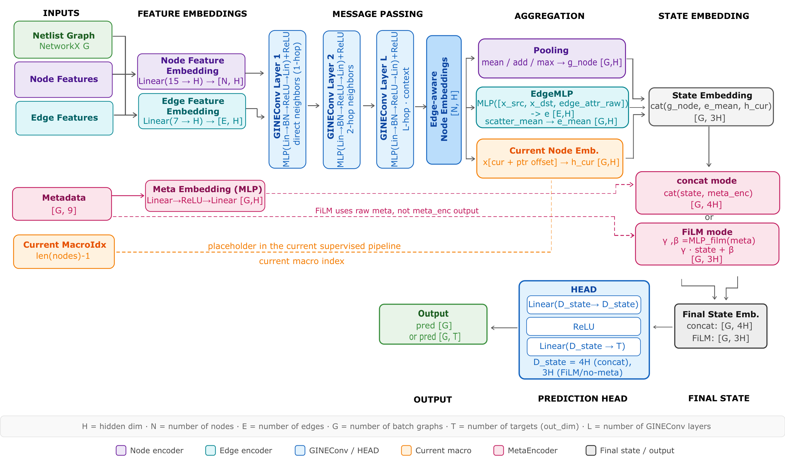

# GNN Encoders for Power Module Layout Optimization

**Investigations into the Application of Graph Neural Network Encoder for Component Placement in the Context of Power Module Layout Optimization**

Master's Thesis · M.Sc. Data Science · Kiel University of Applied Sciences · 2026
Author: **Gamze Önder**


---

This repository gives an overview of my master's thesis. It explains the problem, method, experiments and main results, and describes how the code base is organized.

> **Code and data availability:** The simulation datasets used in this thesis are proprietary, and the implementation belongs to an ongoing research project. For these reasons, neither the code nor the data is published here. The project structure below is described for documentation purposes only.

## Table of Contents

- [Overview](#overview)
- [Research Questions](#research-questions)
- [Contributions](#contributions)
- [Method](#method)
- [Experiments](#experiments)
- [Key Results](#key-results)
- [Limitations and Future Work](#limitations-and-future-work)
- [Project Structure](#project-structure)
- [Tech Stack](#tech-stack)
- [Citation](#citation)
- [References](#references)
- [Acknowledgements](#acknowledgements)

## Overview

Learning-based placement methods, especially deep reinforcement learning (DRL) approaches such as the chip-placement work of Mirhoseini et al. [[5]](#references) ([Circuit Training / AlphaChip](https://github.com/google-research/circuit_training)), have shown strong results in VLSI design. Graph neural network encoders have also been used for layout planning in other domains [[6]](#references). The performance of these methods depends heavily on the **state encoder**: the network that turns the current layout into a compact representation the agent can act on.

Power module layouts are harder than VLSI placement in one important way. Their quality depends on **coupled thermal and electrical effects**, not only on geometric objectives such as wirelength [[1–3]](#references). This thesis asks whether graph-based encoders designed for VLSI placement can be adapted to **2D SiC power module layouts** and learn physically meaningful representations of them.

The thesis focuses on the **encoder stage** of a future RL framework. The encoder is pretrained with supervised learning to predict simulation-derived thermal and electrical layout metrics. The full RL loop (policy and value networks, reward design, PPO training) is outside the scope of this work.

<p align="center">
  
</p>
<p align="center"><sub>The GNN encoder (this thesis) turns the layout observation into the state embedding. Policy network, value network and PPO are standard RL components and are not implemented in this thesis.</sub></p>

## Research Questions

1. **RQ1 – State encoding transferability.** Can Edge-GNN-based encoder architectures, originally developed for VLSI placement, be adapted to represent the multi-physics constraints and complex geometries of conventional 2D SiC power module layouts?
2. **RQ2 – Representation capability.** Can the learned graph embeddings distinguish between layouts with different physical properties, such as high and low inductance or different thermal behavior? Do they provide a suitable basis for a future DRL-based placement agent?

## Contributions

- A **graph-based representation pipeline** for power module layouts
- **Supervised training of GNN encoders** on simulation-derived thermal and electrical targets
- A systematic **experimental evaluation** of target normalization, pooling, loss functions, rotated layouts and hyperparameter configurations
- An **analysis** of whether the learned embeddings capture physically meaningful layout properties

## Method

### Pipeline



### Layout as a graph

Each layout is converted into a graph:

- **Nodes** are physical components: chips, bond pads and connectors. Node features include position, size, voltage potential, normalized power loss and component type (15 encoded features).
- **Edges** are physical or electrical connections: bond wires and conductor traces. Edge features include bond length, bond-loop height, potential type and connection type (7 encoded features).
- **Metadata** holds global layout information: canvas size, grid size, number of devices and number of connectors.

<!-- TODO: add an example layout and its graph representation (thesis Fig. 3.3 / 3.4) once approved -->

### Encoder architecture

The main encoder is a **GINE** (Graph Isomorphism Network with Edge features) network [[7, 8]](#references), which uses edge attributes directly in message passing. GraphSAGE [[9]](#references) is used as a baseline.



<details>
<summary><b>Detailed architecture (tensor shapes and layers)</b></summary>



</details>

The final state embedding combines four parts:

$$z_i = \left[ g_{\mathrm{node}},\ e_{\mathrm{mean}},\ h_{\mathrm{cur}},\ m_{\mathrm{emb}} \right]$$

These are the pooled node representation, an edge-level summary, the embedding of the currently active component, and the encoded layout metadata. The regression head is used only during supervised pretraining. In a future RL setting it is removed, and $z_i$ becomes the agent's state representation.

<details>
<summary><b>Code excerpt: building the state embedding (simplified)</b></summary>

```python
import torch
import torch.nn as nn
from torch_geometric.nn import GINEConv, global_add_pool
from torch_scatter import scatter_mean


class GINEStateEncoder(nn.Module):
    """Simplified version of the thesis encoder: layout graph -> state embedding z."""

    def __init__(self, node_in=15, edge_in=7, meta_in=9, hidden=64, num_layers=2):
        super().__init__()
        self.node_encoder = nn.Linear(node_in, hidden)
        self.edge_encoder = nn.Linear(edge_in, hidden)
        self.convs = nn.ModuleList(
            GINEConv(
                nn.Sequential(
                    nn.Linear(hidden, hidden), nn.BatchNorm1d(hidden),
                    nn.ReLU(), nn.Linear(hidden, hidden),
                ),
                edge_dim=hidden,
            )
            for _ in range(num_layers)
        )
        self.edge_mlp = nn.Sequential(nn.Linear(2 * hidden + edge_in, hidden), nn.ReLU())
        self.meta_encoder = nn.Sequential(nn.Linear(meta_in, hidden), nn.ReLU(), nn.Linear(hidden, hidden))

    def forward(self, data):
        x = self.node_encoder(data.x)
        edge_attr = self.edge_encoder(data.edge_attr)

        # Edge-aware message passing
        for conv in self.convs:
            x = torch.relu(conv(x, data.edge_index, edge_attr))

        # 1) Pooled node representation
        g_node = global_add_pool(x, data.batch)

        # 2) Edge-level summary
        src, dst = data.edge_index
        e = self.edge_mlp(torch.cat([x[src], x[dst], data.edge_attr], dim=-1))
        e_mean = scatter_mean(e, data.batch[src], dim=0)

        # 3) Embedding of the currently active component
        h_cur = x[data.current_macro_idx + data.ptr[:-1]]

        # 4) Encoded layout metadata
        m_emb = self.meta_encoder(data.meta)

        return torch.cat([g_node, e_mean, h_cur, m_emb], dim=-1)  # state embedding z
```

> ⚠️ This is a shortened illustration of the architecture described above. The full implementation (graph construction from simulation data, feature schema, training pipeline, HPO and evaluation) is not publicly available.

</details>

### Training

- Graph-level regression, single-target and multi-target
- Adam optimizer [[11]](#references), learning-rate scheduler, early stopping on validation MAE
- Loss functions: MAE, MSE, Smooth L1 / Huber
- Target normalization: none, z-score, min-max
- Predefined train / validation / test splits to reduce leakage between structurally similar layouts; normalization is fitted on the training split only
- Metrics (MAE, RMSE, R²) are computed on the original physical scale

## Experiments

| # | Experiment | Purpose |
|---|---|---|
| 1.1 | **Single-target prediction** | Test how learnable each target is, and the effect of normalization, pooling and loss |
| 1.2 | **Thermal boundary conditions** | Check whether temperature targets stay predictable when thermal boundary conditions vary |
| — | **Target selection** | Choose a stable, physically meaningful target vector |
| 2 | **Multi-target prediction** | Test whether one shared embedding can predict several objectives |
| 3 | **Rotated layouts** | Test robustness to layout rotation (train on 0°/180°/270°, test on unseen 90°) |
| 4 | **Hyperparameter optimization** | 300 random-search trials per normalization method, ranked by validation R² |

**Selected multi-target vector** (reliability, thermal homogeneity, thermal interaction, electrical):

$$y_i = \left( D_{\mathrm{lin,norm}},\ F_{TH},\ F_{TIH},\ L_{\mathrm{loop}} \right)$$

**HPO search space:** hidden dimension {16, 32, 64, 128} · GINE layers {1–4} · dropout {0–0.4} · pooling {add, mean, max} · loss {MAE, MSE, Huber} · batch size · learning-rate factor.

## Key Results

> **Strong validation performance:** With z-score normalization, the multi-target encoder reaches a **validation R² above 0.80 for all four targets**. For the loop inductance $L_{\mathrm{loop}}$, the validation R² is **0.994–0.999** across all normalization methods.

- **Graph encoders transfer to power modules.** An edge-aware GINE encoder learns meaningful relationships between layout graphs and physical targets (RQ1).
- **Loop inductance is captured very well.** $L_{\mathrm{loop}}$ reached a **validation R² of 0.994–0.999**, depending on the normalization.
- **One shared embedding for several objectives.** The multi-target model predicts reliability, thermal and electrical metrics at the same time, which is what a future RL state representation needs (RQ2).
- **Data split and layout grouping affect the results.** A manually defined split was used to reduce leakage between structurally similar layouts, because similar layouts in both training and validation can overestimate generalization. Even under the same settings, the prediction behavior **differs between netlist groups** and depends on the chip configuration. The composition of the training data therefore has to be considered when building and evaluating the model.
- **Normalization matters.** Z-score normalization depends on the statistics of the training split and was the most consistent. Min-max depends on the chosen target bounds and compressed predictions into narrow bands when the data did not cover the full target range.
- **Rotation robustness must be learned.** A model trained on one orientation formed separate prediction clusters for rotated layouts. Adding rotated variants to training improved the predictions on an unseen 90° orientation.
- **Consistent best configuration.** The best HPO configurations all used a **hidden dimension of 64, 2 GINE layers and MAE loss**. They differed in pooling and dropout.

**Best HPO configuration per normalization method (validation):**

| Normalization | Val MAE | Val RMSE | Val R² | Pooling | Hidden | Layers | Dropout | Loss |
|---|---|---|---|---|---|---|---|---|
| None | 0.0828 | 0.1217 | 0.841 | add | 64 | 2 | 0.0 | MAE |
| Z-score | 0.1178 | 0.1762 | **0.873** | max | 64 | 2 | 0.3 | MAE |
| Min-max | 0.1277 | 0.2153 | 0.868 | mean | 64 | 2 | 0.0 | MAE |

**Per-target validation R² (best configuration per normalization):**

| Normalization | $D_{\mathrm{lin,norm}}$ | $F_{TH}$ | $F_{TIH}$ | $L_{\mathrm{loop}}$ |
|---|---|---|---|---|
| None | 0.821 | 0.712 | 0.711 | **0.999** |
| Z-score | **0.831** | **0.813** | 0.803 | 0.995 |
| Min-max | 0.820 | 0.805 | **0.814** | 0.994 |

<!-- TODO: optionally add a prediction-vs-ground-truth figure (e.g. figures/pred_vs_gt.png) once approved -->

## Limitations and Future Work

- **Absolute temperature targets** ($T_{\mathrm{max}}$, $T_{\mathrm{avg}}$, …) depend on thermal boundary conditions (power loss, ambient temperature, convection) that are not yet part of the graph input.
- **Dataset size and diversity.** Larger and more balanced datasets are needed, covering more netlist families, chip counts, rotations and boundary conditions.
- **More robust evaluation.** Netlist-based cross-validation and ablation studies of the graph representation.
- **Rotation-invariant modeling**, instead of relying on data augmentation alone.
- **Full RL integration.** Connect the pretrained encoder to policy and value networks and a PPO-based placement environment.

## Project Structure

The implementation is organized as a modular Python library plus experiment notebooks. Every experiment is fully described by a JSON config file.

```
├── lib/
│   ├── config.py                     # Loads JSON experiment configs, selects the device
│   ├── pre_processing/
│   │   ├── feature_schema.py         # Node/edge feature definitions, encoding, normalization
│   │   ├── convert_graph_to_pyg_data.py   # Raw layout graph → PyTorch Geometric Data
│   │   ├── graph_dataset_builder.py  # Joins graphs, targets and metadata into datasets
│   │   └── build_loaders_from_datasets.py # Leakage-safe normalization and DataLoaders
│   ├── models/
│   │   ├── gine.py                   # GINE-based graph-level regressor (main encoder)
│   │   ├── sage.py                   # GraphSAGE baselines
│   │   ├── edge_mlp.py               # Learned edge embeddings
│   │   ├── metadata.py               # Metadata encoder
│   │   └── model_factory.py          # Builds the model selected in the config
│   ├── training/
│   │   ├── run_experiment.py         # End-to-end experiment runner
│   │   ├── training_utils.py         # Training loop, losses, early stopping
│   │   ├── targets_normalization.py  # None / z-score / min-max target scaling
│   │   ├── k_fold.py                 # Grouped k-fold cross-validation
│   │   └── inference.py              # Prediction on new layout graphs
│   └── post_processing/
│       ├── plots.py                  # Prediction-vs-ground-truth and training curves
│       ├── tables.py                 # Metric tables (incl. LaTeX export)
│       ├── compare_runs.py           # Compares saved experiment runs
│       └── embedding_analysis.py     # Projects and analyzes learned embeddings
├── configs/                          # JSON configs for each experiment
├── experiments/                      # Training and analysis notebooks (Experiments 1–3)
└── hyperparameter_optimization/      # HPO notebooks (random search per normalization)
```

## Tech Stack

Python · PyTorch · PyTorch Geometric [[10]](#references) · NumPy · pandas · scikit-learn · Matplotlib · Jupyter

## Citation

```bibtex
@mastersthesis{oender2026gnnencoder,
  author  = {Gamze {\"O}nder},
  title   = {Investigations into the Application of Graph Neural Network Encoder
             for Component Placement in the Context of Power Module Layout Optimization},
  school  = {Kiel University of Applied Sciences},
  address = {Kiel, Germany},
  year    = {2026},
  type    = {Master's Thesis},
  note    = {Unpublished}
}
```

## References

A selection of the main references. The full bibliography is in the thesis.

1. R. Rassmann, Y. Shen, X. Dong, U. Schuemann, and R. Mallwitz, "Optimization of semiconductor bare die positions within multi-chip power modules," in *PCIM Conference 2025*, VDE, 2025, pp. 1830–1838.
2. R. Rassmann et al., "Automated electrical and thermal optimization of conventional multi-chip power modules," in *CIPS 2026; 14th International Conference on Integrated Power Electronics Systems*, 2026, pp. 749–757.
3. R. Rassmann et al., "A holistic optimization approach for ANPC power modules in high-performance applications," in *CIPS 2026*, 2026, pp. 342–350.
4. D. S. Lopera, L. Servadei, G. N. Kiprit, S. Hazra, R. Wille, and W. Ecker, "A survey of graph neural networks for electronic design automation," in *2021 ACM/IEEE 3rd Workshop on Machine Learning for CAD (MLCAD)*, IEEE, 2021.
5. A. Mirhoseini et al., "A graph placement methodology for fast chip design," *Nature*, vol. 594, no. 7862, pp. 207–212, 2021.
6. L. Kaven, A. Göppert, and R. H. Schmitt, "Graph neural network encoder for layout planning and scheduling in line-less mobile assembly systems," *Procedia CIRP*, vol. 120, pp. 63–68, 2023.
7. K. Xu, W. Hu, J. Leskovec, and S. Jegelka, "How powerful are graph neural networks?" in *ICLR*, 2019.
8. W. Hu et al., "Strategies for pre-training graph neural networks," *arXiv:1905.12265*, 2019.
9. W. Hamilton, Z. Ying, and J. Leskovec, "Inductive representation learning on large graphs," in *NeurIPS*, vol. 30, 2017.
10. M. Fey and J. E. Lenssen, "Fast graph representation learning with PyTorch Geometric," *arXiv:1903.02428*, 2019.
11. D. P. Kingma and J. Ba, "Adam: A method for stochastic optimization," *arXiv:1412.6980*, 2014.

## Acknowledgements

I thank my supervisors **Prof. Dr. Patrick Hennig** and **Prof. Dr. Ulf Schümann**, and my advisor **Rando Raßmann (M.Eng.)**, for their guidance and support throughout this thesis.